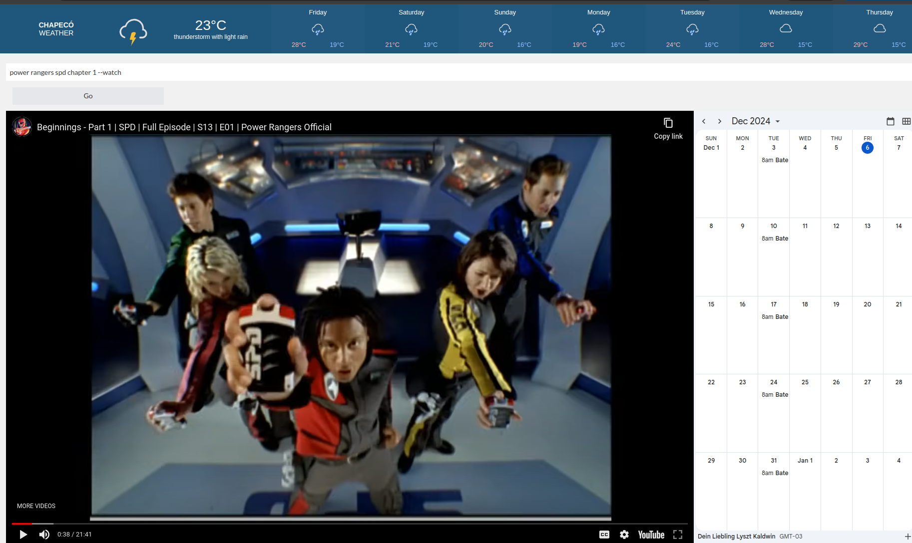

# The Scarlett Dashboard

### Continuation of the Scarlett Gateway, but better!
> One must still have chaos in oneself to be able to give birth to a dancing star. I tell you: you have yet to become chaos within yourselves. You must be ready to burn yourself in your own flame; how could you rise anew if you have not first become ashes?

Scarlett Gateway began as a productivity tool designed to simplify daily life and streamline task management. The original version, built with HTML, CSS, JavaScript, and PHP, functioned as a standalone web application with a focus on agendas, automation, and reminders. It offered an integrated system for organizing schedules, automating repetitive tasks, and keeping track of important events through notifications. Designed as a personal productivity hub, it combined tools like a dynamic calendar and note-taking capabilities.

The original Scarlett Gateway was eventually discontinued as its core features were split across two new projects: Providentia, which took over the daily life functionalities like task automation and reminders, and my website, Lyszt.net, a platform focused on professional blogging and showcasing technical work. These changes allowed for a more focused approach to productivity and organization.

## The return of the Scarlett Gateway 
The modern Scarlett Dashboard is the spiritual successor to the original project. It retains the same goal of enhancing productivity but introduces a host of new features and improvements, thanks to its adoption of a React frontend, Vite for fast development, and a backend powered by Node.js and Express.

**Features of the Modern Scarlett Dashboard**
- Weather Integration

  Provides real-time weather updates with weekly forecasts.
  A clean, intuitive display ensures users can plan their activities with ease.
- Dynamic Link Processing

  Features a powerful link processing system, allowing users to embed content, like YouTube videos, directly into the interface.
  Integrates the YouTube API for intelligent link transformations, such as automatically converting standard video links into embeddable formats or searching for video content based on user queries.
- Interactive Calendar System
  A robust calendar enables users to track their events, deadlines, and reminders in a centralized location.
  Designed with synchronization and ease-of-use in mind, it ensures tasks are always accessible.
- Improved User Authentication
  Introduces secure login functionality with session management, ensuring a personalized experience for each user.
  Scalable Full-Stack Architecture

Powered by a modern stack, including React, Vite, Node.js, and Express, making it faster, more maintainable, and easier to expand in the future. Backend endpoints handle complex tasks, such as API calls for external services like weather or YouTube content.

The Scarlett Dashboard is designed to seamlessly integrate with various projects, creating a unified ecosystem for productivity and connectivity. It connects with the homepage to extend its functionality, integrates with a Discord bot to provide real-time updates and reminders within a server, and offers mobile-friendly design to ensure accessibility across all devices. This interconnected system will also automate the process of delivering reminders, schedules, and updates, making the dashboard a central hub for managing tasks, projects, and real-time interactions efficiently.

